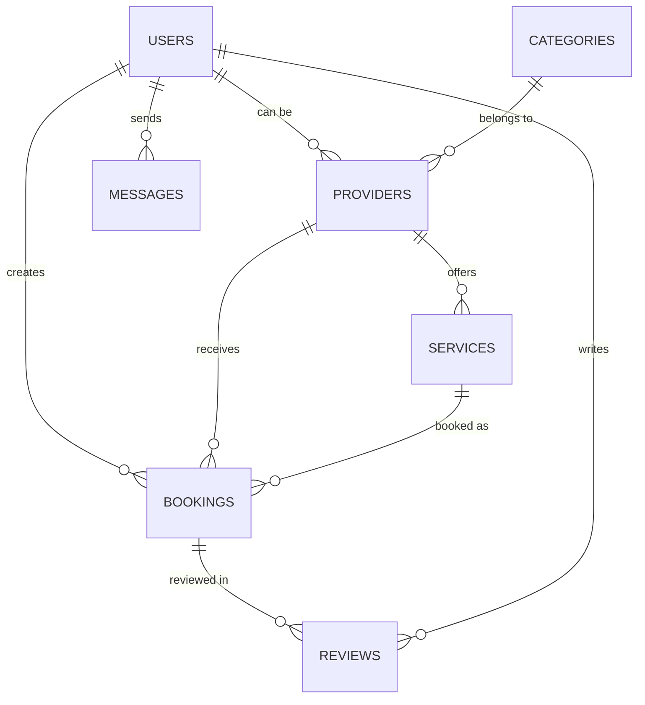
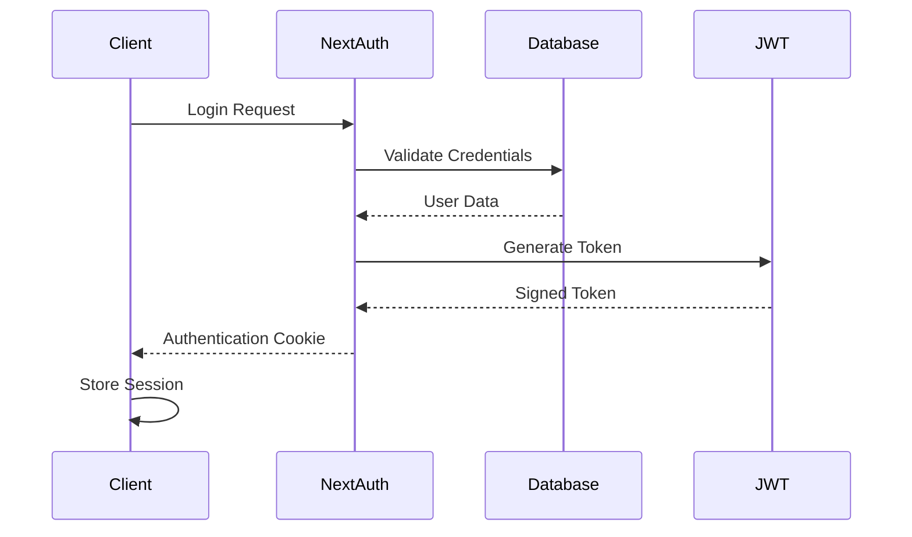
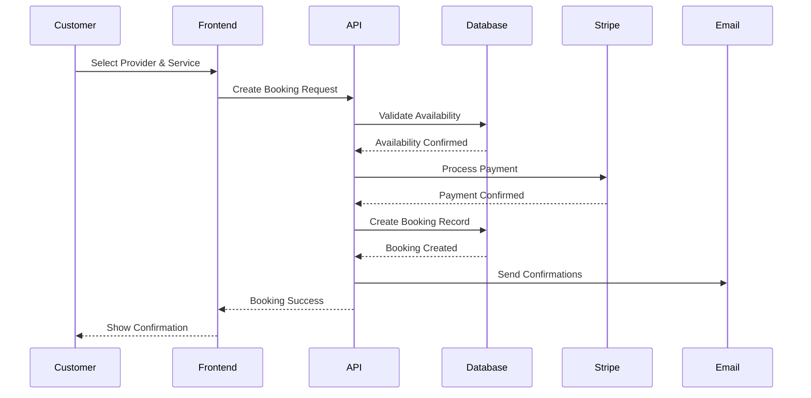
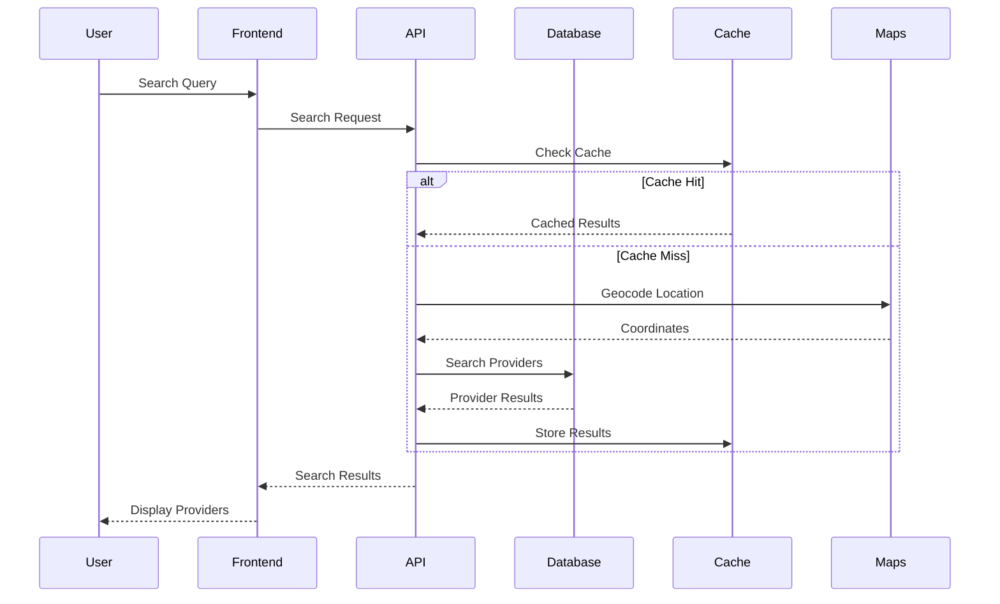
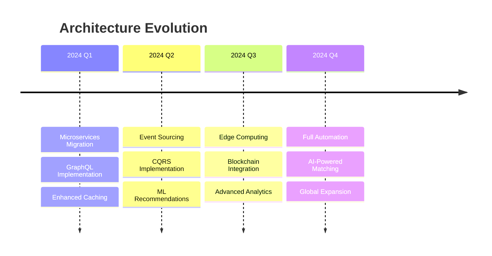

# Architecture Overview

This document provides a comprehensive overview of Loconomy's system architecture, design decisions, and technical implementation. It serves as a guide for developers, system architects, and stakeholders to understand how the platform is built and operates.

## 🏗️ System Architecture

### **High-Level Architecture**

```
┌─────────────────┐    ┌─────────────────┐    ┌─────────────────┐
│   Client Apps   │    │   Web Browser   │    │  Mobile Apps    │
│  (iOS/Android)  │    │   (React SPA)   │    │ (React Native)  │
└─────────┬───────┘    └─────────┬───────┘    └─────────┬───────┘
          │                      │                      │
          └──────────────────────┼──────────────────────┘
                                 │
                         ┌───────▼───────┐
                         │   CDN/WAF     │
                         │  (Cloudflare) │
                         └───────┬───────┘
                                 │
                    ┌────────────▼────────────┐
                    │     Load Balancer      │
                    │    (Vercel/AWS ALB)    │
                    └────────────┬────────────┘
                                 │
        ┌────────────────────────┼────────────────────────┐
        │                       │                        │
┌───────▼───────┐    ┌──────────▼──────────┐    ┌────────▼────────┐
│  Next.js App  │    │   Next.js App      │    │  Next.js App   │
│  (Instance 1) │    │   (Instance 2)     │    │  (Instance N)  │
└───────┬───────┘    └──────────┬──────────┘    └────────┬────────┘
        │                       │                        │
        └───────────────────────┼────────────────────────┘
                                │
                    ┌───────────▼───────────┐
                    │    API Gateway       │
                    │   (Kong/AWS API GW)  │
                    └───────────┬───────────┘
                                │
    ┌───────────────────────────┼───────────────────────────┐
    │                           │                           │
┌───▼────┐  ┌─────────▼─────────┐  ┌─────────▼─────────┐   │
│ Auth   │  │   Core Services   │  │  External APIs    │   │
│Service │  │   (Microservices) │  │  (Stripe, Maps)   │   │
└────────┘  └───────────────────┘  └───────────────────┘   │
                     │                                     │
            ┌────────▼────────┐                           │
            │   Message Queue │                           │
            │   (Redis/SQS)   │                           │
            └────────┬────────┘                           │
                     │                                     │
    ┌────────────────┼─────────────────────────────────────┘
    │                │                      
┌───▼────┐  ┌────────▼────────┐  ┌─────────────────┐
│Database│  │     Cache       │  │   File Storage  │
│(Postgres)│ │    (Redis)      │  │    (AWS S3)    │
└────────┘  └─────────────────┘  └─────────────────┘
```

### **Technology Stack**

#### **Frontend Layer**
- **Framework**: Next.js 14 with App Router
- **Language**: TypeScript
- **Styling**: Tailwind CSS + Custom CSS Variables
- **State Management**: Zustand + React Query
- **UI Components**: Radix UI + Custom Components
- **Forms**: React Hook Form + Zod Validation
- **Testing**: Jest + React Testing Library + Playwright

#### **Backend Layer**
- **Runtime**: Node.js 18+
- **API**: Next.js API Routes (RESTful)
- **Authentication**: NextAuth.js + JWT
- **Database**: PostgreSQL with Prisma ORM
- **Caching**: Redis
- **File Storage**: AWS S3
- **Email**: SendGrid
- **Payments**: Stripe

#### **Infrastructure Layer**
- **Deployment**: Vercel (Primary) / AWS ECS (Enterprise)
- **CDN**: Cloudflare
- **Monitoring**: Sentry + PostHog
- **CI/CD**: GitHub Actions
- **Analytics**: PostHog + Google Analytics

---

## 🗃️ Data Architecture

### **Database Schema**

```sql
-- Core entities and relationships

-- Users (customers and providers)
CREATE TABLE users (
  id UUID PRIMARY KEY DEFAULT gen_random_uuid(),
  email VARCHAR(255) UNIQUE NOT NULL,
  display_name VARCHAR(255) NOT NULL,
  avatar_url TEXT,
  phone VARCHAR(20),
  is_verified BOOLEAN DEFAULT FALSE,
  role user_role DEFAULT 'customer',
  created_at TIMESTAMP WITH TIME ZONE DEFAULT NOW(),
  updated_at TIMESTAMP WITH TIME ZONE DEFAULT NOW()
);

-- Provider profiles
CREATE TABLE providers (
  id UUID PRIMARY KEY DEFAULT gen_random_uuid(),
  user_id UUID REFERENCES users(id) ON DELETE CASCADE,
  business_name VARCHAR(255) NOT NULL,
  bio TEXT,
  cover_photo_url TEXT,
  category_id UUID REFERENCES categories(id),
  rating_average DECIMAL(3,2) DEFAULT 0,
  rating_count INTEGER DEFAULT 0,
  response_time_minutes INTEGER,
  is_active BOOLEAN DEFAULT TRUE,
  created_at TIMESTAMP WITH TIME ZONE DEFAULT NOW()
);

-- Service categories
CREATE TABLE categories (
  id UUID PRIMARY KEY DEFAULT gen_random_uuid(),
  name VARCHAR(100) NOT NULL,
  slug VARCHAR(100) UNIQUE NOT NULL,
  description TEXT,
  icon_name VARCHAR(50),
  parent_id UUID REFERENCES categories(id),
  sort_order INTEGER DEFAULT 0
);

-- Services offered by providers
CREATE TABLE services (
  id UUID PRIMARY KEY DEFAULT gen_random_uuid(),
  provider_id UUID REFERENCES providers(id) ON DELETE CASCADE,
  name VARCHAR(255) NOT NULL,
  description TEXT,
  price DECIMAL(10,2) NOT NULL,
  duration_minutes INTEGER,
  is_active BOOLEAN DEFAULT TRUE
);

-- Bookings
CREATE TABLE bookings (
  id UUID PRIMARY KEY DEFAULT gen_random_uuid(),
  customer_id UUID REFERENCES users(id),
  provider_id UUID REFERENCES providers(id),
  service_id UUID REFERENCES services(id),
  status booking_status DEFAULT 'pending',
  scheduled_at TIMESTAMP WITH TIME ZONE NOT NULL,
  duration_minutes INTEGER,
  location JSONB NOT NULL,
  notes TEXT,
  pricing JSONB NOT NULL,
  created_at TIMESTAMP WITH TIME ZONE DEFAULT NOW()
);

-- Reviews and ratings
CREATE TABLE reviews (
  id UUID PRIMARY KEY DEFAULT gen_random_uuid(),
  booking_id UUID REFERENCES bookings(id),
  customer_id UUID REFERENCES users(id),
  provider_id UUID REFERENCES providers(id),
  rating INTEGER CHECK (rating >= 1 AND rating <= 5),
  title VARCHAR(255),
  content TEXT,
  would_recommend BOOLEAN,
  created_at TIMESTAMP WITH TIME ZONE DEFAULT NOW()
);

-- Messages between users
CREATE TABLE messages (
  id UUID PRIMARY KEY DEFAULT gen_random_uuid(),
  conversation_id UUID NOT NULL,
  sender_id UUID REFERENCES users(id),
  recipient_id UUID REFERENCES users(id),
  content TEXT NOT NULL,
  message_type message_type DEFAULT 'text',
  read_at TIMESTAMP WITH TIME ZONE,
  created_at TIMESTAMP WITH TIME ZONE DEFAULT NOW()
);
```

### **Data Relationships**



---

## 🔄 Application Flow

### **User Authentication Flow**



### **Booking Creation Flow**



### **Search & Discovery Flow**



---

## 🏭 Microservices Architecture

### **Service Breakdown**

#### **Core Services**
- **User Service**: Authentication, profiles, preferences
- **Provider Service**: Provider management, verification
- **Booking Service**: Booking lifecycle, scheduling
- **Payment Service**: Payment processing, billing
- **Notification Service**: Email, SMS, push notifications
- **Search Service**: Provider discovery, filtering
- **Review Service**: Reviews, ratings, feedback

#### **Supporting Services**
- **File Service**: Image/document upload and management
- **Analytics Service**: Tracking, reporting, insights
- **Communication Service**: In-app messaging, video calls
- **Geolocation Service**: Location services, mapping

### **Inter-Service Communication**

```typescript
// Example service interface
interface UserService {
  createUser(data: CreateUserData): Promise<User>;
  getUserById(id: string): Promise<User | null>;
  updateUser(id: string, data: UpdateUserData): Promise<User>;
  deleteUser(id: string): Promise<void>;
}

interface BookingService {
  createBooking(data: CreateBookingData): Promise<Booking>;
  getBookingsByUser(userId: string): Promise<Booking[]>;
  updateBookingStatus(id: string, status: BookingStatus): Promise<Booking>;
}

// Service registry pattern
class ServiceRegistry {
  private services = new Map<string, unknown>();

  register<T>(name: string, service: T): void {
    this.services.set(name, service);
  }

  get<T>(name: string): T {
    return this.services.get(name) as T;
  }
}
```

---

## 🔒 Security Architecture

### **Authentication & Authorization**

```typescript
// JWT token structure
interface JWTPayload {
  sub: string; // User ID
  role: UserRole;
  permissions: Permission[];
  iat: number;
  exp: number;
}

// Role-based access control
enum UserRole {
  CUSTOMER = 'customer',
  PROVIDER = 'provider',
  ADMIN = 'admin',
  SUPER_ADMIN = 'super_admin'
}

// Permission system
enum Permission {
  READ_PROFILE = 'read:profile',
  WRITE_PROFILE = 'write:profile',
  CREATE_BOOKING = 'create:booking',
  MANAGE_BOOKINGS = 'manage:bookings',
  ADMIN_ACCESS = 'admin:access'
}
```

### **Data Protection**

- **Encryption at Rest**: AES-256 for sensitive data
- **Encryption in Transit**: TLS 1.3 for all communications
- **API Security**: Rate limiting, input validation, CORS
- **Database Security**: Row-level security, encrypted connections
- **File Security**: Signed URLs, virus scanning

### **Security Headers**

```typescript
// Security middleware
export function securityHeaders() {
  return {
    'X-Frame-Options': 'DENY',
    'X-Content-Type-Options': 'nosniff',
    'X-XSS-Protection': '1; mode=block',
    'Strict-Transport-Security': 'max-age=31536000; includeSubDomains',
    'Content-Security-Policy': "default-src 'self'; script-src 'self' 'unsafe-inline'",
    'Referrer-Policy': 'origin-when-cross-origin'
  };
}
```

---

## 📈 Scalability & Performance

### **Horizontal Scaling**

```yaml
# Auto-scaling configuration
apiVersion: autoscaling/v2
kind: HorizontalPodAutoscaler
metadata:
  name: loconomy-app-hpa
spec:
  scaleTargetRef:
    apiVersion: apps/v1
    kind: Deployment
    name: loconomy-app
  minReplicas: 2
  maxReplicas: 50
  metrics:
  - type: Resource
    resource:
      name: cpu
      target:
        type: Utilization
        averageUtilization: 70
  - type: Resource
    resource:
      name: memory
      target:
        type: Utilization
        averageUtilization: 80
```

### **Caching Strategy**

```typescript
// Multi-level caching
class CacheService {
  constructor(
    private redisClient: Redis,
    private memoryCache: NodeCache
  ) {}

  async get<T>(key: string): Promise<T | null> {
    // L1: Memory cache (fastest)
    let value = this.memoryCache.get<T>(key);
    if (value) return value;

    // L2: Redis cache (fast)
    const redisValue = await this.redisClient.get(key);
    if (redisValue) {
      value = JSON.parse(redisValue);
      this.memoryCache.set(key, value, 300); // 5 min TTL
      return value;
    }

    return null;
  }

  async set<T>(key: string, value: T, ttl: number): Promise<void> {
    // Store in both caches
    this.memoryCache.set(key, value, ttl);
    await this.redisClient.setex(key, ttl, JSON.stringify(value));
  }
}
```

### **Database Optimization**

```sql
-- Optimized indexes for common queries
CREATE INDEX CONCURRENTLY idx_providers_location_category 
  ON providers USING GiST (location, category_id);

CREATE INDEX CONCURRENTLY idx_bookings_provider_status_date 
  ON bookings (provider_id, status, scheduled_at);

CREATE INDEX CONCURRENTLY idx_reviews_provider_rating 
  ON reviews (provider_id, rating) 
  WHERE rating IS NOT NULL;

-- Partitioning for large tables
CREATE TABLE bookings_2024 PARTITION OF bookings
  FOR VALUES FROM ('2024-01-01') TO ('2025-01-01');
```

---

## 🔄 Event-Driven Architecture

### **Event Types**

```typescript
// Domain events
interface DomainEvent {
  id: string;
  type: string;
  aggregateId: string;
  version: number;
  data: unknown;
  metadata: EventMetadata;
  timestamp: Date;
}

// Event examples
interface BookingCreatedEvent extends DomainEvent {
  type: 'booking.created';
  data: {
    bookingId: string;
    customerId: string;
    providerId: string;
    serviceId: string;
    scheduledAt: Date;
    amount: number;
  };
}

interface PaymentProcessedEvent extends DomainEvent {
  type: 'payment.processed';
  data: {
    paymentId: string;
    bookingId: string;
    amount: number;
    status: 'success' | 'failed';
  };
}
```

### **Event Processing**

```typescript
// Event bus implementation
class EventBus {
  private handlers = new Map<string, EventHandler[]>();

  subscribe<T extends DomainEvent>(
    eventType: string,
    handler: EventHandler<T>
  ): void {
    const handlers = this.handlers.get(eventType) || [];
    handlers.push(handler);
    this.handlers.set(eventType, handlers);
  }

  async publish<T extends DomainEvent>(event: T): Promise<void> {
    const handlers = this.handlers.get(event.type) || [];
    
    await Promise.all(
      handlers.map(handler => 
        handler.handle(event).catch(error => 
          console.error(`Error handling event ${event.type}:`, error)
        )
      )
    );
  }
}

// Event handlers
class EmailNotificationHandler implements EventHandler<BookingCreatedEvent> {
  async handle(event: BookingCreatedEvent): Promise<void> {
    const { customerId, providerId, bookingId } = event.data;
    
    await this.emailService.sendBookingConfirmation({
      recipientId: customerId,
      bookingId,
      providerId
    });
  }
}
```

---

## 🧪 Testing Architecture

### **Testing Pyramid**

```typescript
// Unit tests (70%)
describe('BookingService', () => {
  it('should create booking with valid data', async () => {
    const service = new BookingService(mockRepository);
    const result = await service.createBooking(validBookingData);
    expect(result).toBeDefined();
  });
});

// Integration tests (20%)
describe('Booking API', () => {
  it('should create booking via API', async () => {
    const response = await request(app)
      .post('/api/bookings')
      .send(bookingData)
      .expect(201);
    
    expect(response.body.id).toBeDefined();
  });
});

// E2E tests (10%)
test('Complete booking flow', async ({ page }) => {
  await page.goto('/providers/123');
  await page.click('[data-testid="book-service"]');
  // ... complete flow test
});
```

---

## 📊 Monitoring & Observability

### **Metrics Collection**

```typescript
// Custom metrics
class MetricsCollector {
  private prometheus = new PrometheusRegistry();
  
  constructor() {
    this.registerMetrics();
  }

  private registerMetrics() {
    // Business metrics
    this.bookingCounter = new Counter({
      name: 'bookings_total',
      help: 'Total number of bookings created',
      labelNames: ['status', 'category']
    });

    // Performance metrics
    this.responseTimeHistogram = new Histogram({
      name: 'http_request_duration_seconds',
      help: 'HTTP request duration',
      labelNames: ['method', 'route', 'status']
    });
  }

  recordBooking(status: string, category: string) {
    this.bookingCounter.inc({ status, category });
  }
}
```

### **Distributed Tracing**

```typescript
// OpenTelemetry setup
import { NodeTracerProvider } from '@opentelemetry/sdk-node';
import { getNodeAutoInstrumentations } from '@opentelemetry/auto-instrumentations-node';

const provider = new NodeTracerProvider({
  instrumentations: [getNodeAutoInstrumentations()]
});

provider.register();

// Custom spans
const tracer = trace.getTracer('loconomy-app');

async function createBooking(data: BookingData) {
  const span = tracer.startSpan('createBooking');
  
  try {
    span.setAttributes({
      'booking.providerId': data.providerId,
      'booking.serviceType': data.serviceType
    });

    const result = await bookingService.create(data);
    span.setStatus({ code: SpanStatusCode.OK });
    return result;
  } catch (error) {
    span.recordException(error);
    span.setStatus({ code: SpanStatusCode.ERROR });
    throw error;
  } finally {
    span.end();
  }
}
```

---

## 🔮 Future Architecture Considerations

### **Planned Enhancements**

1. **GraphQL API**: Transition from REST to GraphQL for better client flexibility
2. **Event Sourcing**: Implement event sourcing for audit trails and replay capabilities
3. **CQRS**: Separate read/write models for better performance
4. **Serverless Functions**: Edge computing for location-based services
5. **AI/ML Pipeline**: Real-time recommendation engine
6. **Blockchain**: Smart contracts for service agreements

### **Technology Roadmap**



---

## 📚 Documentation & Resources

### **Architecture Decision Records (ADRs)**

- [ADR-001: Technology Stack Selection](docs/adrs/001-technology-stack.md)
- [ADR-002: Database Choice](docs/adrs/002-database-choice.md)
- [ADR-003: Authentication Strategy](docs/adrs/003-authentication-strategy.md)
- [ADR-004: Caching Strategy](docs/adrs/004-caching-strategy.md)

### **Reference Materials**

- **API Documentation**: [API.md](API.md)
- **Deployment Guide**: [DEPLOYMENT.md](DEPLOYMENT.md)
- **Security Guidelines**: [SECURITY.md](SECURITY.md)
- **Testing Strategy**: [TESTING.md](TESTING.md)

---

## 👥 Team Contacts

- **Chief Architect**: [architecture@loconomy.com](mailto:architecture@loconomy.com)
- **Platform Team**: [platform@loconomy.com](mailto:platform@loconomy.com)
- **DevOps Team**: [devops@loconomy.com](mailto:devops@loconomy.com)
- **Security Team**: [security@loconomy.com](mailto:security@loconomy.com)

---

*This architecture document is a living document that evolves with our platform. For questions or suggestions, please reach out to the architecture team or create an issue in our repository.*