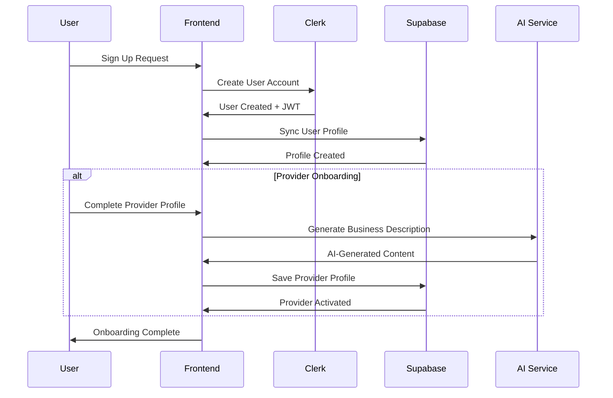
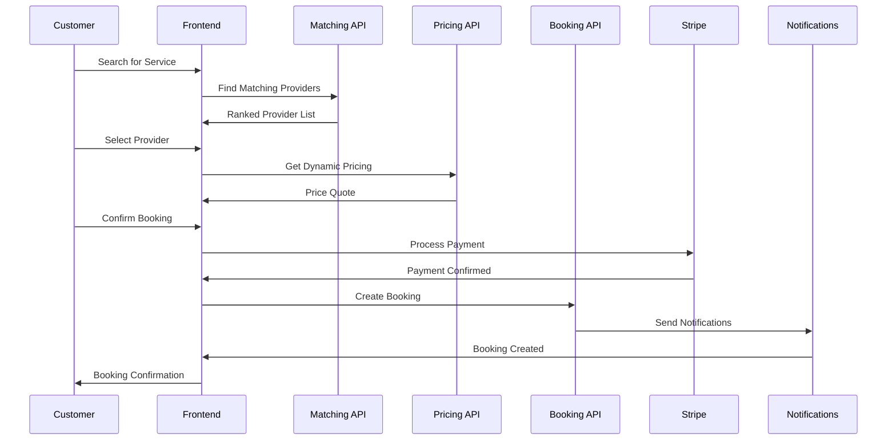
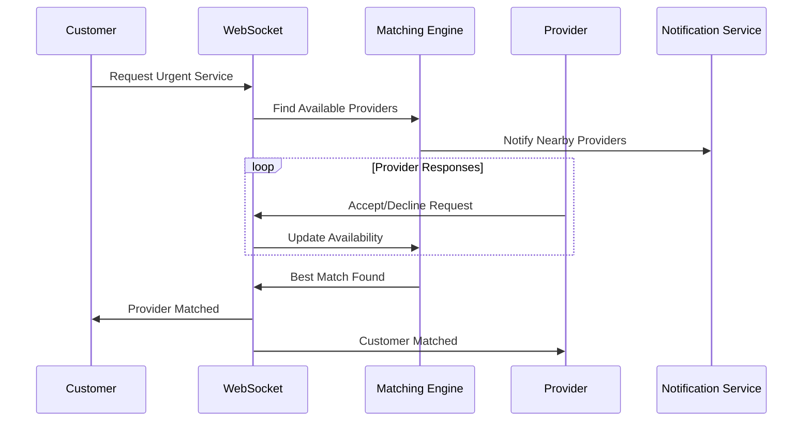
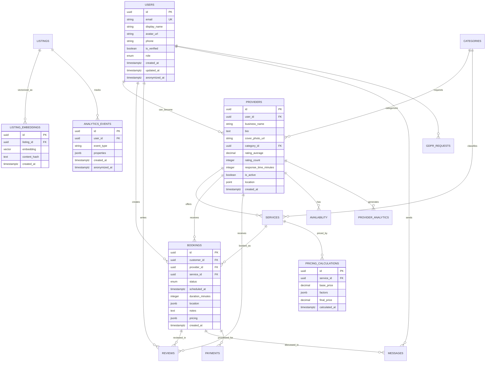
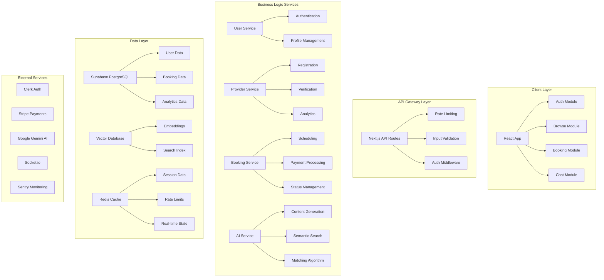
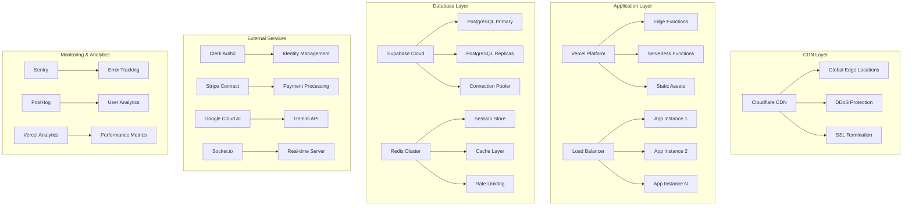
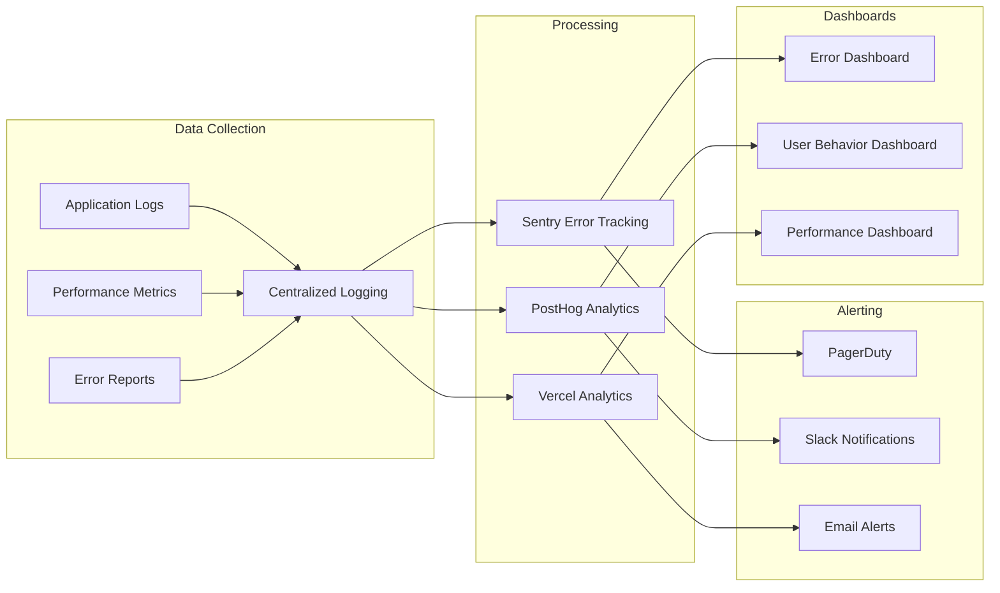
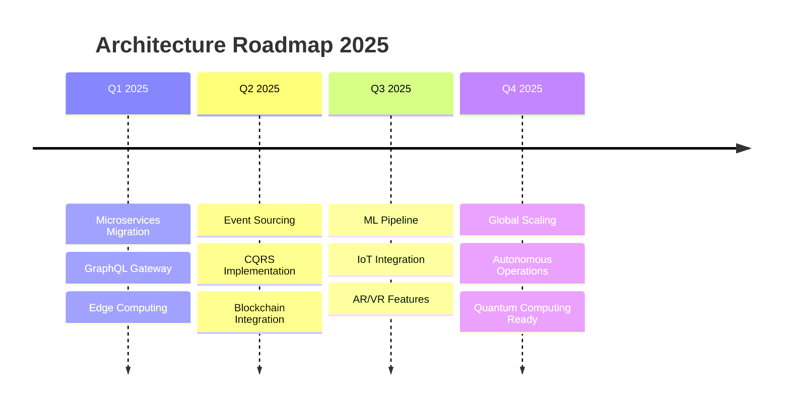

# 🏗️ LOCONOMY ARCHITECTURE MAPS & DIAGRAMS
*Generated: December 27, 2024*

---

## 📊 MODULE DEPENDENCY GRAPH

```mermaid
graph TB
    subgraph "Frontend Layer"
        A[app/layout.tsx] --> B[components/auth/auth-provider.tsx]
        A --> C[components/ui/*]
        A --> D[components/providers/*]
        
        E[app/page.tsx] --> F[components/hero-section.tsx]
        E --> G[components/categories-section.tsx]
        E --> H[components/providers-section.tsx]
        
        I[app/browse/page.tsx] --> J[components/browse/BrowseFilters.tsx]
        I --> K[components/browse/BrowseResults.tsx]
        I --> L[components/browse/ProviderCard.tsx]
    end
    
    subgraph "API Layer"
        M[app/api/listings/route.ts] --> N[lib/supabase/client.ts]
        M --> O[lib/security/input-validation.ts]
        
        P[app/api/ai/compose-listing/route.ts] --> Q[lib/ai/llm-client.ts]
        P --> R[lib/ai/embeddings.ts]
        
        S[app/api/auth/signin/route.ts] --> T[lib/auth/auth-utils.ts]
        S --> U[components/auth/clerk-auth-provider.tsx]
    end
    
    subgraph "Core Libraries"
        N --> V[Database: Supabase PostgreSQL]
        Q --> W[AI: Google Gemini]
        R --> X[Vector Store: pgvector]
        T --> Y[Auth: Clerk + Supabase]
    end
    
    subgraph "External Services"
        Z[Stripe Connect] --> AA[Payment Processing]
        BB[Socket.io] --> CC[Real-time Communication]
        DD[Sentry] --> EE[Error Monitoring]
        FF[PostHog] --> GG[Analytics]
    end
    
    B --> Y
    M --> Z
    P --> BB
    A --> DD
    A --> FF
```



---

## 🔌 API CONTRACT MAP

### **Authentication Endpoints**
```yaml
/api/auth:
  POST /signin:
    request: { email: string, password: string, rememberMe?: boolean }
    response: { success: boolean, error?: string }
    auth: none
    
  POST /signup:
    request: { email: string, password: string, firstName: string, lastName: string, userType: UserRole }
    response: { success: boolean, needsVerification?: boolean }
    auth: none

/api/users:
  GET /:
    query: { id?: string }
    response: User | User[]
    auth: required
    
  POST /sync:
    request: ClerkWebhookEvent
    response: { success: boolean }
    auth: webhook
```

### **Core Business Endpoints**
```yaml
/api/listings:
  GET /:
    query: { q?: string, category?: string, location?: LocationFilter, priceRange?: PriceFilter }
    response: { listings: Listing[], total: number, page: number }
    auth: optional
    
  POST /:
    request: CreateListingRequest
    response: { listing: Listing }
    auth: required (provider)

/api/ai/compose-listing:
  POST /:
    request: { prompt: string, category?: string, location?: string }
    response: { listing: AIGeneratedListing, usage: TokenUsage }
    auth: required
    rate_limit: 10/hour

/api/matching:
  POST /:
    request: { serviceId: string, location: Location, preferences?: MatchingPreferences }
    response: { providers: ScoredProvider[], algorithm: string }
    auth: required
```

### **AI & Advanced Features**
```yaml
/api/search/semantic:
  POST /:
    request: { query: string, filters?: SearchFilters, limit?: number }
    response: { results: SemanticSearchResult[], similarity_scores: number[] }
    auth: optional
    
/api/pricing/dynamic:
  GET /:
    query: { serviceId: string, location: Location, datetime: ISO8601 }
    response: { price: number, factors: PricingFactors, surge_active: boolean }
    auth: optional

/api/gdpr:
  GET /export:
    response: { download_url: string, expires_at: ISO8601 }
    auth: required
    
  DELETE /delete:
    request: { confirmation: string }
    response: { deletion_scheduled: ISO8601, grace_period_days: number }
    auth: required
```

---

## 🔄 EVENT FLOW DIAGRAMS

### **User Onboarding Flow**


### **Service Booking Flow**


### **Real-time Matching Flow**


---

## 🗄️ DATA MODELS & SCHEMA RELATIONSHIPS

### **Core Entity Relationships**


### **Advanced Feature Schema**
```sql
-- AI Vector Embeddings for Semantic Search
CREATE EXTENSION IF NOT EXISTS vector;

CREATE TABLE listing_embeddings (
    id UUID PRIMARY KEY DEFAULT gen_random_uuid(),
    listing_id UUID REFERENCES listings(id) ON DELETE CASCADE,
    embedding vector(1536), -- OpenAI ada-002 dimension
    content_hash TEXT NOT NULL,
    created_at TIMESTAMPTZ DEFAULT NOW()
);

-- Create vector similarity index
CREATE INDEX listing_embeddings_vector_idx 
ON listing_embeddings USING ivfflat (embedding vector_cosine_ops);

-- Dynamic Pricing Engine
CREATE TABLE pricing_calculations (
    id UUID PRIMARY KEY DEFAULT gen_random_uuid(),
    service_id UUID REFERENCES services(id),
    base_price DECIMAL(10,2) NOT NULL,
    factors JSONB NOT NULL, -- demand, supply, time, location multipliers
    final_price DECIMAL(10,2) NOT NULL,
    surge_active BOOLEAN DEFAULT FALSE,
    calculated_at TIMESTAMPTZ DEFAULT NOW()
);

-- Provider Availability System
CREATE TABLE provider_availability (
    id UUID PRIMARY KEY DEFAULT gen_random_uuid(),
    provider_id UUID REFERENCES providers(id) ON DELETE CASCADE,
    day_of_week INTEGER CHECK (day_of_week BETWEEN 0 AND 6),
    start_time TIME NOT NULL,
    end_time TIME NOT NULL,
    is_available BOOLEAN DEFAULT TRUE,
    created_at TIMESTAMPTZ DEFAULT NOW()
);

-- GDPR Compliance Tables
CREATE TABLE data_deletion_requests (
    id UUID PRIMARY KEY DEFAULT gen_random_uuid(),
    user_id UUID REFERENCES users(id) ON DELETE CASCADE,
    requested_at TIMESTAMPTZ DEFAULT NOW(),
    scheduled_deletion_at TIMESTAMPTZ,
    status TEXT DEFAULT 'pending' CHECK (status IN ('pending', 'approved', 'completed', 'cancelled')),
    reason TEXT
);
```

---

## 🏢 SERVICE BOUNDARIES

### **Frontend Microservices Architecture**


### **Service Communication Patterns**
```typescript
// Service Interface Definitions
interface UserService {
  createUser(data: CreateUserData): Promise<User>
  getUserById(id: string): Promise<User | null>
  updateUser(id: string, data: UpdateUserData): Promise<User>
  deleteUser(id: string): Promise<void>
}

interface BookingService {
  createBooking(data: CreateBookingData): Promise<Booking>
  getBookingsByUser(userId: string): Promise<Booking[]>
  updateBookingStatus(id: string, status: BookingStatus): Promise<Booking>
  cancelBooking(id: string, reason?: string): Promise<void>
}

interface AIService {
  generateContent(prompt: string, options: AIOptions): Promise<AIResponse>
  searchSemantic(query: string, filters: SearchFilters): Promise<SearchResult[]>
  matchProviders(request: MatchingRequest): Promise<MatchingResult>
}

// Event-Driven Communication
interface DomainEvent {
  id: string
  type: string
  aggregateId: string
  data: unknown
  timestamp: Date
}

// Service Registry Pattern
class ServiceRegistry {
  private services = new Map<string, unknown>()
  
  register<T>(name: string, service: T): void {
    this.services.set(name, service)
  }
  
  get<T>(name: string): T {
    return this.services.get(name) as T
  }
}
```

---

## 🚀 DEPLOYMENT TOPOLOGY

### **Production Infrastructure**


### **Auto-Scaling Configuration**
```yaml
# Vercel Edge Configuration
vercel:
  functions:
    'app/api/**/*.ts':
      memory: 1024
      maxDuration: 30
  
  build:
    env:
      NEXT_PUBLIC_SUPABASE_URL: $SUPABASE_URL
      NEXT_PUBLIC_CLERK_PUBLISHABLE_KEY: $CLERK_KEY
      
# Kubernetes HPA (Future Enhancement)
apiVersion: autoscaling/v2
kind: HorizontalPodAutoscaler
metadata:
  name: loconomy-hpa
spec:
  scaleTargetRef:
    apiVersion: apps/v1
    kind: Deployment
    name: loconomy-app
  minReplicas: 2
  maxReplicas: 50
  metrics:
  - type: Resource
    resource:
      name: cpu
      target:
        type: Utilization
        averageUtilization: 70
  - type: Resource
    resource:
      name: memory
      target:
        type: Utilization
        averageUtilization: 80
```

---

## 🔍 OBSERVABILITY ARCHITECTURE

### **Monitoring Stack**


### **Key Metrics Tracking**
```typescript
// Business Metrics
interface BusinessMetrics {
  bookingsPerHour: number
  revenuePerDay: number
  userGrowthRate: number
  providerActivationRate: number
  averageOrderValue: number
  customerLifetimeValue: number
}

// Technical Metrics
interface TechnicalMetrics {
  responseTime: number
  errorRate: number
  throughput: number
  availability: number
  memoryUsage: number
  cpuUtilization: number
}

// Custom Metrics Collection
class MetricsCollector {
  recordBooking(booking: Booking) {
    this.counter('bookings_total').inc()
    this.histogram('booking_value').observe(booking.amount)
  }
  
  recordAIUsage(usage: TokenUsage) {
    this.counter('ai_tokens_used').inc(usage.totalTokens)
    this.gauge('ai_cost_daily').set(usage.cost)
  }
}
```

---

## 🔮 FUTURE ARCHITECTURE EVOLUTION

### **Planned Enhancements**


### **Microservices Evolution**
```typescript
// Future Service Architecture
interface ServiceMesh {
  userService: MicroService
  providerService: MicroService
  bookingService: MicroService
  paymentService: MicroService
  notificationService: MicroService
  analyticsService: MicroService
  aiService: MicroService
}

// Event Sourcing Implementation
class EventStore {
  async append(streamId: string, events: DomainEvent[]): Promise<void>
  async getEvents(streamId: string, fromVersion?: number): Promise<DomainEvent[]>
  async subscribe(eventType: string, handler: EventHandler): Promise<void>
}

// CQRS Command/Query Separation
interface CommandBus {
  send<T>(command: Command<T>): Promise<T>
}

interface QueryBus {
  ask<T>(query: Query<T>): Promise<T>
}
```

---

*This architecture documentation provides a comprehensive view of Loconomy's current system design and future evolution path, enabling confident scaling and development decisions.*
